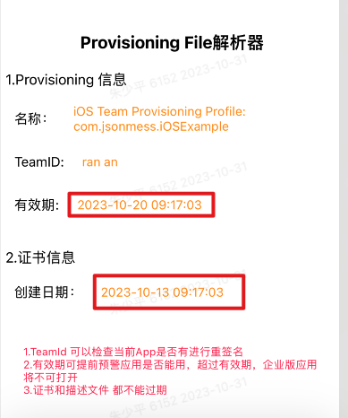

# ProvisioningProfileParser
fetch some useful information  from  Apple  ProvisioningProfile 

 iOS App for Enterprise Edition  have inner  provisioningProfile  whitch is only valid for one year
this project can get  'expiration date'、’create date'、'team name'....

iOS 企业版app 内置的 provisioningProfile 有效期只有一年，这个demo可以从 provisioningProfile 中读取有效信息

比如”证书构建日期、有效期等“

截图如下：

